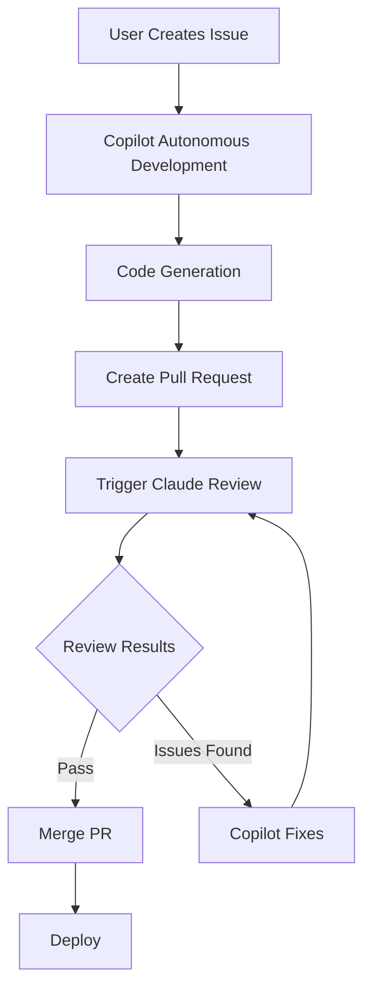

# GitHub Copilot + Claude Autonomous Development Workflow

This document describes the complete workflow for using GitHub Copilot for autonomous development with Claude code review integration.

## 🔄 Complete Workflow Overview



## 1. 🎯 Issue Creation Phase

### Manual Issue Creation
1. **Use GitHub Issue Template**: `.github/ISSUE_TEMPLATE/copilot-autonomous-task.md`
2. **Fill Required Sections**:
   - Problem description with clear requirements
   - Architecture layer specification (entities/use cases/adapters/frameworks)
   - Performance targets and benchmarks
   - Explicit file paths to create/modify
   - Definition of done criteria

### Issue Requirements for Autonomous Development
```markdown
## Problem Description
Implement user authentication with JWT tokens for the e-commerce platform

## Architecture Requirements
- **Layer**: Adapters (authentication adapter)
- **Dependencies**: Must not depend on framework specifics
- **Interfaces**: Define authentication traits in use cases layer

## Acceptance Criteria
- [ ] JWT token generation and validation
- [ ] User login/logout endpoints
- [ ] Session management
- [ ] Performance: <200ms for authentication operations
- [ ] Test coverage: >90%

## Files to Create/Modify
- `src/adapters/auth/jwt_auth.rs`
- `src/use_cases/auth/authenticate_user.rs`
- `src/entities/user.rs` (extend if needed)
- `tests/auth/jwt_auth_test.rs`
```

## 2. 🤖 Copilot Autonomous Development

### Copilot Implementation Process
1. **Reads Context**: Copilot uses `.github/copilot-instructions.md` for coding standards
2. **Follows Architecture**: Implements Clean Architecture patterns automatically
3. **Creates Files**: Generates code following project conventions
4. **Writes Tests**: Includes comprehensive test coverage
5. **Updates Documentation**: Adds/updates relevant documentation

### Configuration Files Used by Copilot
- **`.github/copilot-instructions.md`**: Main development guidelines
- **`.github/copilot-context.md`**: Project domain knowledge
- **`.github/copilot-setup-steps.yml`**: Environment setup

### Expected Copilot Output
- ✅ **Clean Architecture Compliance**: Proper layer separation
- ✅ **SOLID Principles**: Single responsibility, dependency inversion
- ✅ **Technology Standards**: Language-specific best practices
- ✅ **Performance Optimization**: Meets specified benchmarks
- ✅ **Comprehensive Testing**: Unit and integration tests
- ✅ **Security Best Practices**: Input validation, error handling

## 3. 📝 Pull Request Creation

### Automated PR Creation
When Copilot completes implementation:
1. **Creates Branch**: Feature branch with descriptive name
2. **Commits Changes**: Well-structured commits with clear messages
3. **Opens Pull Request**: Using PR template with pre-filled sections
4. **Links Issue**: Automatically links to originating issue

### PR Template Sections
- **🎯 Summary**: Feature description and type
- **🤖 AI Development Workflow**: Copilot implementation details
- **🏗️ Architecture Impact**: Clean Architecture layer changes
- **🚀 Performance Impact**: Performance targets validation
- **🔒 Security Review**: Security considerations
- **🧪 Testing & Quality**: Test coverage and quality metrics

## 4. 🔍 Claude Code Review Phase

### Triggering Claude Reviews

#### Direct GitHub App Integration
Claude GitHub app responds automatically to `@claude` mentions in PR/issue comments:

```markdown
# In PR comments - triggers Claude directly
@claude /review-architecture    # Architecture compliance
@claude /review-performance     # Performance analysis  
@claude /review-security        # Security validation
@claude /review-testing         # Test coverage review
@claude /review-integration     # Integration patterns
```

**No GitHub Actions Required** - Claude reads your configuration automatically!

### Claude Review Process
1. **Loads Context**: Reads `CLAUDE.md` for project understanding
2. **Applies Command**: Uses specific review template from `.claude/commands/`
3. **Analyzes Code**: Reviews changed files against criteria
4. **Generates Report**: Structured feedback with scores and recommendations
5. **Posts Comment**: Detailed review results in PR

### Review Output Format
```markdown
## Claude Review Results for /review-architecture

### ✅ Compliant Areas
- Clean Architecture layer separation properly maintained
- Dependency rule followed (dependencies point inward)
- SOLID principles correctly applied

### ⚠️ Areas for Improvement
- `src/adapters/auth/jwt_auth.rs:45` - Consider extracting error handling
- `src/use_cases/auth/authenticate_user.rs:23` - Add input validation

### 🚨 Critical Issues
None identified

### 📋 Recommendations
1. Add comprehensive error handling for JWT validation failures
2. Consider implementing rate limiting for authentication attempts

### 🎯 Architecture Score: 8/10
Strong adherence to Clean Architecture with minor improvements needed.
```

## 5. 🔄 Feedback Loop & Iteration

### When Claude Identifies Issues
1. **Review Results Posted**: Claude provides specific feedback
2. **Copilot Addresses Issues**: 
   - `@copilot please address the Claude review feedback`
   - Copilot reads Claude's comments and makes improvements
3. **Re-review Process**: Claude reviews updated code
4. **Iteration Continues**: Until all criteria are met

### Quality Gates
- **Architecture Score**: ≥8/10 required for merge
- **Performance Score**: ≥8/10 required for merge  
- **Security Score**: ≥9/10 required for merge
- **Testing Score**: ≥8/10 required for merge
- **All Tests Passing**: CI/CD validation required

## 6. ✅ Merge & Deployment

### Pre-Merge Checklist
- [ ] All Claude reviews completed with satisfactory scores
- [ ] All automated tests passing
- [ ] Performance benchmarks met
- [ ] Security validation passed
- [ ] Architecture compliance confirmed
- [ ] Documentation updated

### Post-Merge Actions
1. **Issue Closure**: Automatically closes linked issue
2. **Deployment**: Triggers deployment pipeline
3. **Monitoring**: Performance and error monitoring activated
4. **Feedback Collection**: Results inform future development

## 🛠️ Configuration Setup

### Initial Setup Commands
```bash
# Generate complete Copilot + Claude configuration
python generators/generate-copilot-config.py project-config.yml

# Generate only Claude integration (for existing projects)
python generators/generate-copilot-config.py project-config.yml --claude-only

# Generate only Copilot configuration (without Claude)
python generators/generate-copilot-config.py project-config.yml --copilot-only
```

### Required Files Generated
```
.github/
├── copilot-instructions.md     # Copilot development guidelines
├── copilot-context.md          # Project context for Copilot
├── copilot-setup-steps.yml     # Environment setup
└── ISSUE_TEMPLATE/
    └── copilot-autonomous-task.md

CLAUDE.md                       # Claude review context (read automatically)
.claude/
└── commands/                   # Custom commands (loaded automatically)
    ├── review-architecture.md  # Architecture review command
    ├── review-performance.md   # Performance review command
    ├── review-security.md      # Security review command
    ├── review-testing.md       # Testing review command
    ├── review-integration.md   # Integration review command
    └── README.md              # Commands documentation
```

### Claude GitHub App Integration
1. **Install Claude GitHub App** in your repository
2. **Generate Configuration**: Run the generator to create `CLAUDE.md` and `.claude/commands/`
3. **Start Reviewing**: Use `@claude /command` in PR comments - no additional setup needed!

## 📈 Continuous Improvement

### Learning Loop
1. **Track Results**: Monitor review scores and issue resolution times
2. **Update Context**: Refine `CLAUDE.md` based on review feedback
3. **Improve Instructions**: Update `.github/copilot-instructions.md` based on patterns
4. **Enhance Commands**: Customize `.claude/commands/` for project-specific needs

### Metrics to Monitor
- **Review Score Trends**: Track improvement over time
- **Issue Resolution Time**: Measure autonomous development speed
- **Code Quality**: Monitor post-deployment performance and bugs
- **Architecture Compliance**: Ensure consistency across features

## 🔧 Troubleshooting

### Common Issues

#### Copilot Not Following Guidelines
- **Check**: `.github/copilot-instructions.md` is specific enough
- **Solution**: Add more detailed examples and constraints

#### Claude Reviews Missing Context
- **Check**: `CLAUDE.md` contains relevant project information
- **Solution**: Update context with domain knowledge and requirements

#### Low Review Scores
- **Check**: Review criteria in `.claude/commands/` files
- **Solution**: Adjust scoring criteria or improve implementation

#### Claude Not Responding to Commands
- **Check**: Claude GitHub app is installed in repository
- **Solution**: Install Claude GitHub app with appropriate permissions

## 🎯 Best Practices

### For Issue Creation
- **Be Specific**: Clear requirements reduce iteration cycles
- **Include Context**: Reference existing code and patterns
- **Set Measurable Goals**: Performance targets, coverage requirements
- **Architecture Focus**: Specify which Clean Architecture layer

### For Review Commands
- **Use Appropriate Command**: Match review type to change type
- **Review Incrementally**: Use multiple commands for complex changes
- **Act on Feedback**: Address Claude recommendations promptly

### For Continuous Improvement
- **Regular Updates**: Keep context files current
- **Monitor Trends**: Track quality metrics over time
- **Team Learning**: Share successful patterns and configurations

This workflow ensures high-quality, architecturally sound code through the collaboration of two AI systems, each optimized for their specific strengths: Copilot for code generation and Claude for comprehensive code review.